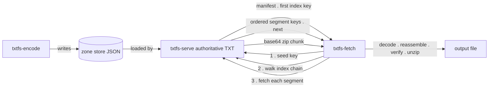

# DNS TXT Record File Transfer Utility — Implementation Specification

**Status:** Draft v1
**Components:** `txtfs-encode` (import/encoder), `txtfs-serve` (authoritative DNS responder), `txtfs-fetch` (download client)
**Runtime:** Python 3.11+, [`dnspython`](https://pypi.org/project/dnspython/) for wire-format handling on both server and client.

---

## 1. Overview

A file is zipped, the zip bytes are split into fixed-size raw segments, each segment is base64-encoded, and each encoded segment is stored as the value of a TXT record keyed by a plausible-looking hostname label. An ordered list of segment keys is published as one or more **index** records; a single **seed** (manifest) record is the entry point that names the file, carries integrity metadata, and points at the first index.

The download client is handed one seed key. It resolves the manifest, walks the index chain to collect the ordered segment keys, fetches every segment, concatenates the decoded bytes back into the zip, verifies integrity, and extracts.



Three record types, all served as TXT:

| Type | Purpose | Value payload |
|------|---------|---------------|
| `manifest` (seed) | Entry point + integrity metadata | compact JSON |
| `index` | Ordered slice of segment keys + `next` pointer | compact JSON |
| `segment` | One base64-encoded raw zip chunk | base64 text only |

---

## 2. DNS and encoding constraints (the numbers that drive the design)

These are hard wire-format limits and they set every size in this spec.

- **`character-string`**: 1 length octet + up to **255** data octets. A TXT record's RDATA is one *or more* concatenated character-strings.
- **RDATA length (`RDLENGTH`)**: 16-bit field → **65 535** bytes max. Splitting `N` payload bytes into 255-byte strings costs `ceil(N/255)` length octets, so the true single-record payload ceiling is **≈ 65 279 bytes (~63.7 KiB)**. This is the origin of the "under 64 kB" figure.
- **Message transport**:
  - UDP without EDNS0: 512 bytes total — unusable for real payloads.
  - UDP with EDNS0: requestor advertises a buffer; **1232 is the fragmentation-safe recommendation**, ~4096 is a common ceiling. A ~64 kB answer will **not** fit.
  - TCP: up to 65 535 bytes per message (2-byte length prefix framing). **The only transport that carries a near-64 kB TXT answer.**

**Consequence — two operating modes, selected by one config knob:**

| Mode | `TXT_PAYLOAD_MAX` (base64 chars) | Raw segment | Transport | Use when |
|------|----------------------------------|-------------|-----------|----------|
| **direct** (default) | 60 000 | 45 000 B | TCP, query authoritative server directly | You control the resolution path (point the client at the server IP). Fewer, larger records. |
| **compatible** | 1 200 | 900 B | EDNS0/UDP (fits 1232) | Traffic must survive arbitrary recursive resolvers. Many small records. |

`45 000` is chosen because it is divisible by 3, so base64 emits exactly `45000 × 4/3 = 60 000` chars with **no padding** and no wasted string. General rule:

```
raw_segment_bytes = (TXT_PAYLOAD_MAX // 4) * 3      # multiple of 3 → no padding
b64_len           = raw_segment_bytes * 4 // 3      # ≤ TXT_PAYLOAD_MAX
```

> **Note on the ambiguous phrasing "less than 64k byte zip segments":** the *TXT record* must stay under the ceiling, and base64 inflates by 4/3. So the **raw** segment must be ~45 kB, not 64 kB — a 64 kB raw segment would base64 to ~85 kB and overflow the record. The spec sizes to the base64 output.

---

## 3. Naming and key generation

Every key is the **leftmost label** of an FQDN: `<key>.<zone>`, e.g. `copper-lantern-drift.f.example.com`.

- **Format:** 3 (default) or 4 dictionary words joined by `-`. Lowercase LDH only, so a valid DNS label. Word-word-word ≈ 16–24 chars, comfortably under the 63-octet label limit.
- **Wordlist:** ~2048 curated words. `3 words → 2048³ ≈ 8.6 × 10⁹` combinations; `4 words → 1.8 × 10¹³`.
- **Collision handling:** the encoder maintains a `set()` of allocated keys and re-rolls on collision. With 3 words the birthday bound puts collision probability around ~0.6 % at 10⁴ segments, so re-rolling is mandatory rather than optional; switch to 4 words above ~10⁴ segments.
- **Seed key:** just the manifest record's key. The encoder prints it (and the full FQDN) on completion — it is the only thing a downloader needs.
- **Optional deterministic derivation (not required):** `key = words(HMAC-SHA256(secret, f"{manifest_id}:{seq}"))`. Not needed because index records enumerate keys explicitly, but useful if you ever want keyspace reproducibility without an index.

---

## 4. Data structures

### 4.1 Zone store (server-side JSON)

A single JSON file the server loads into memory. Flat `key → record` map as requested, with just enough metadata for the server to build the TXT correctly. The DNS-facing value is stored verbatim so the server does zero re-encoding at query time.

```json
{
  "meta": {
    "version": 1,
    "zone": "f.example.com",
    "ttl": 3600,
    "created": "2026-07-04T12:00:00Z",
    "manifest_id": "6b1e...",
    "seed_key": "copper-lantern-drift"
  },
  "records": {
    "copper-lantern-drift": {
      "type": "manifest",
      "value": "{\"v\":1,\"name\":\"report.pdf\",...}"
    },
    "maple-river-glint": {
      "type": "index",
      "value": "{\"v\":1,\"i\":0,\"keys\":[...],\"next\":\"...\"}"
    },
    "amber-fox-signal": {
      "type": "segment",
      "value": "UEsDBBQAAAAIA..."
    }
  }
}
```

- `records[key].value` is the **exact byte payload** placed in the TXT (before 255-byte string splitting).
- The server never needs `type` to answer — it's for tooling/debugging. It answers any known key with its stored `value`.
- Multiple files → multiple seeds in one store, or simply zip several files into one archive (one seed, natural because we use a real zip container).

### 4.2 Manifest / seed record (compact JSON)

```json
{
  "v": 1,
  "name": "report.pdf",
  "size": 1048576,
  "sha256": "e3b0c44298fc1c149afbf4c8996fb924...",
  "sha_target": "original",
  "container": "zip",
  "segments": 24,
  "seg_size": 45000,
  "index": "maple-river-glint"
}
```

| Field | Meaning |
|-------|---------|
| `v` | Format version. |
| `name` | Original filename (or a label if the archive holds many files). |
| `size` | Size of the **original file** in bytes (post-unzip), for progress + a sanity check. |
| `sha256` | SHA-256 of the integrity target (see `sha_target`). |
| `sha_target` | `original` (single file) or `archive` (multi-file); tells the client what `sha256` covers. |
| `container` | `zip`. Reserved for future `raw`/`gzip`. |
| `segments` | Total segment count — lets the client validate index completeness. |
| `seg_size` | Raw segment size, so the client can pre-size buffers (last segment may be shorter). |
| `index` | Key of the first index record. |

Compact JSON keeps this ~200–300 bytes, trivially inside one record.

### 4.3 Index record (compact JSON)

```json
{
  "v": 1,
  "i": 0,
  "keys": ["amber-fox-signal", "quartz-owl-meadow", "..."],
  "next": "spruce-tide-ember"
}
```

| Field | Meaning |
|-------|---------|
| `v` | Format version. |
| `i` | Index chunk ordinal (0-based), for reassembly-order validation. |
| `keys` | Ordered segment keys for this slice. |
| `next` | Key of the next index record, or `null` on the last. |

**Overflow / chaining:** the encoder packs keys into an index until adding another key would push the serialized JSON past `TXT_PAYLOAD_MAX`, then sets `next` to a freshly allocated index key and continues. Sizing at 60 000-byte payload with ~24-char keys (`"key",` ≈ 27 bytes each) gives **~2000 keys per index**, so a chained index scales to arbitrarily large files.

> CSV is a supported lighter alternative (`k1,k2,...,@next`), but JSON is the default — the `next` pointer is unambiguous and the client parser is one `json.loads`.

### 4.4 Segment record (base64 text only)

Pure base64, no wrapper — every byte of the record is payload. Ordering comes from the index; integrity comes from three independent layers (§7), so no per-segment header is needed. Multi-string TXT semantics mean the client simply concatenates the record's character-strings before base64-decoding.

### 4.5 TXT wire representation (255-byte string splitting)

Any `value` longer than 255 bytes becomes multiple `character-string`s in one TXT RR. The receiver concatenates them with **no separator** — standard TXT semantics.

```python
def to_txt_strings(payload: bytes) -> list[bytes]:
    return [payload[i:i+255] for i in range(0, len(payload), 255)]
```

Server-side, build the rdata directly from that list (dnspython preserves the split):

```python
import dns.rdtypes.ANY.TXT, dns.rdataclass, dns.rdatatype
rd = dns.rdtypes.ANY.TXT.TXT(
    dns.rdataclass.IN, dns.rdatatype.TXT, to_txt_strings(value_bytes)
)
```

Client-side, rejoin:

```python
payload = b"".join(rr.strings)   # for the TXT rdata object
```

---

## 5. `txtfs-encode` — import / encoder

**Input:** one or more file paths, target zone, mode/config. **Output:** a zone-store JSON and the printed seed key + FQDN.

**Algorithm:**

1. **Archive.** Write inputs to an in-memory zip with `zipfile.ZipFile(..., ZIP_DEFLATED)`, storing original filename(s). Result is a standard `.zip` extractable by any tool. Capture `zip_bytes`.
2. **Original integrity.** For the single-file case, `sha256` and `size` describe the pre-zip file. (Multi-file: `name` becomes an archive label; `sha256`/`size` describe the zip — set `container` semantics accordingly and document it.)
3. **Segment.** Slice `zip_bytes` into `raw_segment_bytes` chunks (default 45 000; last chunk shorter). For each: `b64 = base64.b64encode(chunk)`.
4. **Allocate segment keys.** One plausible key per segment via §3, collision-checked. Preserve order.
5. **Build indexes.** Pack ordered segment keys into index records (§4.3), chaining with `next` when a record would exceed `TXT_PAYLOAD_MAX`. Allocate a key per index record.
6. **Build manifest.** Populate §4.2, `index` = first index key. Allocate the seed key.
7. **Emit zone store.** Write `records` for manifest + every index + every segment, plus `meta`. Assert every `value` (after string-splitting overhead) fits the ~65 279 ceiling.
8. **Report.** Print seed key, full FQDN, segment count, index count, total record count, and the largest record size (a guardrail against exceeding the ceiling).

**Config surface:** `--zone`, `--mode {direct,compatible}`, `--payload-max`, `--words {3,4}`, `--wordlist PATH`, `--ttl`, `--out zone.json`.

**Validation:** refuse if any single serialized `value` exceeds the payload ceiling; warn if `mode=direct` but `payload_max` is set small enough that record count explodes.

---

## 6. `txtfs-serve` — authoritative DNS responder

`dnspython` is a toolkit, not a server framework: it gives you wire parse/build; you own the socket loop. Use **asyncio** with both a UDP datagram endpoint and a TCP listener.

**Startup:** load zone store into `{key: value_bytes}`; read `meta.zone`, `meta.ttl`.

**Per query:**

1. Parse: `q = dns.message.from_wire(data)`.
2. Extract QNAME + QTYPE from `q.question[0]`.
3. Authority check: QNAME must be within `meta.zone`; else `REFUSED`.
4. QTYPE gate: only `TXT` (and `ANY`) get segment data; other types → empty answer with SOA in authority (below).
5. Key lookup: `key = qname.labels_below_zone[0]` (the label immediately left of the zone).
6. Build response: `r = dns.message.make_response(q)`; set authoritative flag `r.flags |= dns.flags.AA`.
   - **Hit:** add a TXT RRset built from `to_txt_strings(value_bytes)` with `meta.ttl`.
   - **Miss:** `r.set_rcode(dns.rcode.NXDOMAIN)` and add the zone SOA to the authority section (well-formed negative response; enables sane negative caching).
7. **EDNS / truncation:**
   - Read requestor buffer: `q.payload` (0 if no EDNS → treat as 512).
   - Echo EDNS on the response (`r.use_edns(...)` with the server's max).
   - Serialize; if `len(wire) > max(requestor_udp, 512)` **and** this is the UDP path, set `TC` and return a truncated/empty-answer response so the client retries over TCP. Never fragment a large TXT over UDP.
8. **TCP framing:** read 2-byte big-endian length prefix, then the message; reply with `struct.pack("!H", len(wire)) + wire`. This path carries the full ~64 kB answer.

**Skeleton:**

```python
class UDPResolver(asyncio.DatagramProtocol):
    def datagram_received(self, data, addr):
        q = dns.message.from_wire(data)
        r = build_response(q, tcp=False)       # sets TC if oversized
        self.transport.sendto(r.to_wire(), addr)

async def handle_tcp(reader, writer):
    n = struct.unpack("!H", await reader.readexactly(2))[0]
    q = dns.message.from_wire(await reader.readexactly(n))
    wire = build_response(q, tcp=True).to_wire()
    writer.write(struct.pack("!H", len(wire)) + wire)
    await writer.drain(); writer.close()
```

**Operational:** bind UDP+TCP/53 (or a high port for testing, `--port`). Static content → high TTL. For this to resolve through the real DNS hierarchy, delegate a **dedicated subdomain** (`f.example.com`) to this server's IP via NS records at the parent, so you never touch the apex zone. For lab use, the client can query the server IP directly and skip delegation entirely.

---

## 7. `txtfs-fetch` — download client

**Input:** seed key, plus either a delegated zone to resolve normally or an explicit `--server IP[:port]` to query the authoritative responder directly (recommended for `direct` mode so large TXT rides TCP end to end).

**Algorithm:**

1. **Manifest.** Query `seed_key.<zone>` TXT → join strings → `json.loads` → manifest. Record `segments`, `sha256`, `size`, first `index`.
2. **Walk index chain.** Starting at `manifest.index`, fetch each index, append `keys` in order, follow `next` until `null`. Assert `i` increments monotonically and total collected keys == `manifest.segments` (detects a broken/truncated chain early).
3. **Fetch segments.** Query each segment key's TXT, join strings → base64 text. Fetch concurrently (bounded pool, e.g. `asyncio.Semaphore(16)`), but **reassemble strictly in index order**, not completion order.
4. **Reassemble.** `zip_bytes = b"".join(base64.b64decode(seg) for seg in ordered_segments)`.
5. **Verify + extract.** Depending on `container`: verify the reassembled bytes, then `zipfile.ZipFile(BytesIO(zip_bytes)).extractall()`. Verify `sha256`/`size` against the extracted original (single-file case). Zip's own per-entry CRC is a second, independent integrity layer.
6. **Write** to `--out` (default: `manifest.name`).

**Transport within each query:** try EDNS/UDP first (fast path for `compatible` mode); on `TC` set, retry the same query over TCP. In `direct` mode, go straight to TCP. Per-query timeout + bounded retries (segments are idempotent, so retry is safe).

**Config surface:** `--server`, `--zone`, `--concurrency`, `--timeout`, `--retries`, `--out`.

---

## 8. Integrity, errors, and edge cases

**Integrity — three independent layers:**
1. Manifest `sha256` + `size` of the original file (end-to-end).
2. Zip per-entry CRC-32, checked automatically on extraction (catches segment corruption/misorder).
3. Index `segments` count vs. collected keys, and monotonic `i` (catches a truncated index chain).

**Edge cases:**
- **Oversized record:** encoder asserts every serialized `value` ≤ ceiling; hard fail at encode time, never at query time.
- **Last segment:** shorter than `seg_size`; handled naturally by slicing and by base64.
- **Public-resolver truncation:** the reason `direct` mode + explicit `--server` is the default. Through recursive resolvers, oversized/uncacheable TXT may be dropped — use `compatible` mode there.
- **Missing key mid-fetch:** NXDOMAIN on a segment/index → fatal, report which key and its index position.
- **Empty / zero-byte file:** one zip, ≥1 segment, one index with one key — no special case needed.
- **Duplicate content:** each segment gets a unique key regardless of identical bytes (keys are allocated, not content-derived), so no accidental dedup collisions.

---

## 9. Consolidated configuration

| Parameter | Default | Applies to | Notes |
|-----------|---------|-----------|-------|
| `mode` | `direct` | encode, fetch | `direct` (TCP, big records) vs `compatible` (EDNS/UDP, small records). |
| `TXT_PAYLOAD_MAX` | 60 000 (`direct`) / 1 200 (`compatible`) | encode | Base64 chars per record. Drives `raw_segment_bytes`. |
| `raw_segment_bytes` | 45 000 / 900 | encode | `(payload_max // 4) * 3` — multiple of 3, no padding. |
| `words` | 3 (→4 above ~10⁴ segments) | encode | Key word count. |
| `ttl` | 3600 | encode, serve | Static content; high TTL is fine. |
| `zone` | — | all | Delegated subdomain, e.g. `f.example.com`. |
| `server` | — | fetch | Explicit authoritative IP\[:port]; bypasses recursion. |
| `concurrency` | 16 | fetch | Bounded parallel segment fetch. |
| `timeout` / `retries` | 5s / 3 | fetch | Per-query. |

---

## 10. Operational notes

- **Delegation vs. direct.** Real-world resolution needs the zone delegated to the server (NS at the parent). Lab/self-hosted retrieval can point `--server` straight at the box and skip DNS hierarchy entirely, which also sidesteps every intermediary size limit.
- **Caching.** Because content is effectively immutable per key, high TTLs are safe and reduce load; updating a file means encoding a new seed rather than mutating records.
- **Detectability (be honest with yourself here).** Large TXT records, TCP-forced answers, and high-volume TXT queries against one zone are textbook anomalies — any competent DNS monitoring (query-rate baselining, TXT-size histograms, entropy scoring on labels) flags this immediately. This is a legitimate novelty/teaching transport for content you're authorized to serve on infrastructure you control; it is not a covert channel and shouldn't be used to move data past controls you don't own.

---

## 11. Suggested repo layout

```
txtfs/
├── txtfs/
│   ├── common.py      # sizing math, TXT string split/join, key generation, wordlist
│   ├── encode.py      # txtfs-encode
│   ├── serve.py       # txtfs-serve (asyncio UDP+TCP)
│   └── fetch.py       # txtfs-fetch
├── wordlist.txt
├── tests/             # round-trip: encode → serve (loopback high port) → fetch → diff
└── README.md
```

A loopback round-trip test (encode → serve on `127.0.0.1:5353` → fetch → byte-compare original) is the single highest-value test — it exercises segmentation, index chaining, TXT splitting, TCP framing, and reassembly in one pass.
